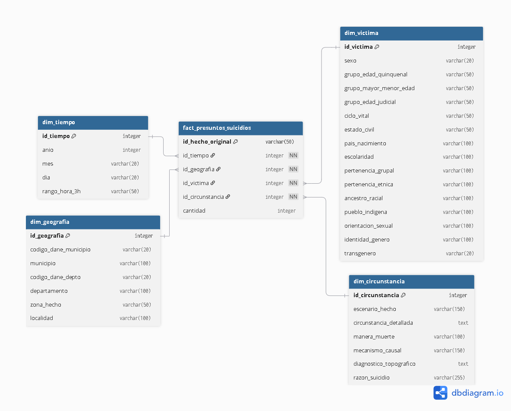

# Presuntos suicidios en Colombia (2015-2024)

## 1. Objetivo

El objetivo es construir un proceso ETL para organizar y analizar los registros de presuntos suicidios ocurridos en Colombia entre 2015 y 2024.

Con este proyecto buscamos responder preguntas como:

- ¿Qué diferencias se observan entre sexo y mecanismo causal?
- ¿Qué grupos de edad y ciclo vital concentran más registros?
- ¿Existen patrones por mes, día y rango horario?
- ¿Cómo se distribuyen los registros entre zonas urbanas y rurales?
- ¿Qué razones reportadas aparecen con mayor frecuencia según el estado civil?
- ¿Cómo se distribuyen los registros según el nivel de escolaridad?
- ¿Qué tan completa es la información de grupos étnicos, pertenencia grupal, orientación sexual e identidad de género?

El proyecto no pretende diagnosticar las causas de los casos ni reemplazar un análisis médico, judicial o de salud pública. Su propósito es organizar la información disponible y facilitar su consulta.

## 2. Relación con los ODS

El proyecto se relaciona con el **ODS 3: Salud y bienestar**, especialmente con la prevención y el análisis de problemas relacionados con la salud mental.

La base permite observar diferencias por edad, sexo, año y ubicación. Estos resultados pueden servir como punto de partida para identificar grupos o territorios que requieren estudios más detallados. La información debe interpretarse con cuidado porque el conjunto contiene presuntos suicidios registrados por el sistema médico-legal, no todos los casos que puedan ocurrir en el país.

## 3. Fuente de datos y evaluación

La fuente utilizada es el portal oficial de Datos Abiertos de Colombia:

- **Dataset:** [Presuntos Suicidios. Colombia, 2015 a 2024. Cifras definitivas](https://www.datos.gov.co/Justicia-y-Derecho/Presuntos-Suicidios-Colombia-2015-a-2024-Cifras-de/f75u-mirk/about_data)
- **Entidad responsable:** Instituto Nacional de Medicina Legal y Ciencias Forenses.
- **Cobertura:** nacional.
- **Periodo:** 2015 a 2024.
- **Número de columnas:** 32.
- **Registros utilizados:** 26.558.
- **Frecuencia de actualización:** anual.
- **Última actualización consultada en el portal:** 18 de mayo de 2026.

La fuente fue seleccionada porque es pública, oficial y cumple los requisitos de la entrega: tiene más de 10.000 filas y más de 10 características. Además, contiene variables de tiempo, ubicación, características de la víctima y circunstancias del hecho.

El portal aclara que los datos corresponden a casos conocidos y registrados por Medicina Legal. Por esta razón, los resultados se presentan como un análisis de registros de presuntos suicidios y no como una medición completa de todos los casos ocurridos en Colombia.

## 4. Requisitos del proyecto

El proyecto busca cumplir los siguientes requisitos de la primera entrega:

1. Obtener un conjunto de datos relacionado con un ODS.
2. Evaluar la fuente, su calidad y sus características.
3. Limpiar y transformar el archivo CSV con Python y Pandas.
4. Diseñar un modelo dimensional para consultas analíticas.
5. Migrar los datos a PostgreSQL.
6. Realizar el EDA usando consultas a la base de datos.
7. Crear visualizaciones que respondan las preguntas del proyecto.
8. Documentar la arquitectura, las herramientas y el proceso realizado.

## 5. Arquitectura del proceso

El flujo implementado es:

```text
CSV de Datos Abiertos
  |
  v
Extracción con Pandas
  |
  v
Limpieza y homologación de categorías
  |
  v
Construcción de dimensiones y tabla de hechos
  |
  v
PostgreSQL
  |
  v
Consultas SQL y visualizaciones del EDA
```

El archivo `01_etl_pipeline.ipynb` realiza la extracción, limpieza, transformación y carga. El archivo `02_etl_eda.ipynb` consulta PostgreSQL y genera las visualizaciones.

## 6. Herramientas utilizadas

- **Python:** lenguaje principal del proyecto.
- **Pandas:** lectura del CSV, limpieza, transformación y preparación de tablas.
- **NumPy:** manejo de valores y tipos de datos.
- **Regex y Unicode:** limpieza de espacios, mayúsculas y tildes.
- **SequenceMatcher:** detección de categorías escritas de forma muy parecida.
- **SQLAlchemy y psycopg2:** conexión entre Python y PostgreSQL.
- **PostgreSQL:** almacenamiento relacional y aplicación de llaves foráneas.
- **Jupyter Notebook:** documentación y ejecución paso a paso.
- **Matplotlib y Seaborn:** elaboración de gráficos.
- **Git y GitHub:** control de versiones y organización del proyecto.

## 7. Transformaciones realizadas

Durante la limpieza se realizaron las siguientes actividades:

- Lectura del CSV con codificación UTF-8.
- Eliminación de espacios al inicio y al final de los nombres de columnas.
- Normalización de los textos: mayúsculas, espacios y tildes.
- Reemplazo de textos vacíos y valores como `N/A`, `NA`, `NULL` y `NONE` por valores nulos.
- Homologación de categorías parecidas mediante `SequenceMatcher`.
- Homologación manual de categorías cuyo significado es equivalente.
- Unificación de categorías educativas. Por ejemplo, `PREESCOLAR` y `EDUCACION INICIAL Y EDUCACION PREESCOLAR` quedan como `PREESCOLAR`; las categorías de especialización, maestría y doctorado quedan como `POSGRADO`.
- Conversión a tipo entero de `ID`, año y códigos DANE.
- Eliminación de registros completamente duplicados.
- Eliminación de duplicados por `ID`, conservando el primer registro.

Después de la limpieza se conservan 26.558 registros, sin duplicados completos y sin valores nulos inesperados en las columnas revisadas.

## 8. Modelo de datos: esquema estrella

Se implementó un esquema estrella. La tabla de hechos contiene un registro por evento y se relaciona con cuatro dimensiones.



### Tabla de hechos

`fact_presuntos_suicidios` contiene:

- `id_hecho_original`
- `id_tiempo`
- `id_geografia`
- `id_victima`
- `id_circunstancia`
- `cantidad`

### Dimensiones

- `dim_tiempo`: año, mes, día y rango de hora.
- `dim_geografia`: códigos DANE, municipio, departamento, zona y localidad.
- `dim_victima`: edad, sexo, ciclo vital, estado civil, escolaridad, pertenencia étnica y otras características.
- `dim_circunstancia`: escenario, circunstancia, manera de muerte, mecanismo, diagnóstico y razón del suicidio.

El script de creación de la base de datos se encuentra en `sql/primera_entrega.sql`. La tabla de hechos tiene llaves foráneas hacia las cuatro dimensiones.

## 9. Líneas de análisis

Las siguientes líneas organizan el análisis del proyecto. El EDA incluye una gráfica general de evolución histórica y siete análisis específicos. Los resultados deben interpretarse como patrones descriptivos de los registros y no como relaciones causales.

### 9.1. Diferencias por sexo y mecanismo causal

Se cruzan `dim_victima.sexo` con `dim_circunstancia.mecanismo_causal` y `dim_circunstancia.diagnostico_topografico`. El objetivo es comparar la distribución de mecanismos entre hombres y mujeres y observar si aparecen diferencias en los diagnósticos registrados.

Este análisis puede aportar información para discutir estrategias diferenciadas de prevención y restricción de medios letales. No se debe afirmar que un sexo utiliza siempre un mecanismo específico sin revisar los resultados y sin contar con información de población expuesta o intentos no fatales.

### 9.2. Edad y ciclo vital

Se utilizan `ciclo_vital`, `grupo_edad_quinquenal` y `grupo_mayor_menor_edad` para comparar adolescencia, juventud, adultez, personas mayores, menores de edad y mayores de edad.

El análisis permite distinguir entre el grupo con mayor volumen absoluto de registros y los grupos que requieren una interpretación particular. No se hablará de tasas por edad a menos que se incorpore una población de referencia.

### 9.3. Estacionalidad, día y hora

Se analizan `anio`, `mes`, `dia` y `rango_hora_3h` de `dim_tiempo`. Esto permite revisar concentraciones por mes, días de la semana y franjas horarias, además de comparar los años 2015 a 2024.

El periodo 2020-2021 puede marcarse como un intervalo de interés para comparar antes, durante y después de la pandemia. Esa comparación será descriptiva y no demostrará por sí sola un efecto del confinamiento.

### 9.4. Diferencias territoriales

Se cruzan `departamento`, `municipio`, `zona_hecho` y `codigo_dane_municipio` de `dim_geografia`. El objetivo es contrastar el volumen de registros de cabeceras municipales y zonas rurales, y localizar territorios que merezcan una revisión más detallada.

Las ciudades grandes pueden tener más registros por su tamaño poblacional. Por eso, el proyecto diferencia entre volumen absoluto y tasa: para calcular tasas se necesitarían datos de población por territorio y año.

### 9.5. Razón reportada, estado civil y circunstancias

Se relacionan `razon_suicidio`, `circunstancia_detallada` y `estado_civil`. Se revisan categorías como conflictos de pareja, enfermedades y dificultades económicas según el estado civil registrado.

El resultado permitirá describir perfiles de los registros y proponer preguntas para estudios posteriores. La columna `razon_suicidio` no debe interpretarse automáticamente como una causa médica comprobada.

### 9.6. Escolaridad

Se comparan `escolaridad`, `grupo_edad_quinquenal` y `razon_suicidio`. En la limpieza se consolidaron categorías equivalentes, por ejemplo, las categorías de preescolar, básica primaria, básica secundaria y posgrado.

El análisis mostrará cómo se distribuyen los registros por nivel educativo y qué razones aparecen dentro de cada grupo. No se describirá la escolaridad como un factor protector sin un diseño estadístico y una población de comparación.

### 9.7. Poblaciones y calidad del dato

Se revisan `pertenencia_grupal`, `pertenencia_etnica`, `pueblo_indigena`, `orientacion_sexual` e `identidad_genero`.

Además de buscar diferencias descriptivas entre grupos, se medirá cuántos registros contienen valores como `SIN INFORMACION`, `NO REGISTRA` o `NO HABIA SIDO IMPLEMENTADA`. Esto permite evaluar la calidad de las variables sensibles y evitar conclusiones basadas en información incompleta.

### Visualizaciones actuales

El notebook `02_etl_eda.ipynb` ya realiza consultas SQL sobre PostgreSQL y genera:

1. **Total histórico:** evolución general de los registros entre 2015 y 2024.
2. **Sexo y mecanismo causal:** barras comparativas por sexo y mecanismo.
3. **Edad y ciclo vital:** distribución de registros por ciclo vital.
4. **Día y hora:** mapa de calor por día de la semana y rango horario.
5. **Territorio:** comparación de zonas del hecho en los departamentos con más registros.
6. **Razón y estado civil:** razones reportadas según el estado civil.
7. **Escolaridad:** distribución de registros por nivel educativo.
8. **Calidad del dato:** cantidad de registros sin información en variables sensibles.

El análisis se construye a partir de las tablas almacenadas en PostgreSQL y no directamente desde el CSV original.

En el notebook, cada análisis está acompañado por una breve descripción de la pregunta, las variables utilizadas y la forma correcta de interpretar la gráfica. Esto facilita la explicación del proyecto durante la sustentación.

## 10. Estructura del repositorio

```text
etl_project/
├── assets/
│   ├── primera_entrega_star.png
│   └── consultas/
├── data/
│   └── Presuntos_Suicidios._Colombia,_2015_a_2024.csv
├── docs/
├── notebooks/
│   ├── 01_etl_pipeline.ipynb
│   └── 02_etl_eda.ipynb
├── sql/
│   └── primera_entrega.sql
├── .gitignore
├── README.md
└── requirements.txt
```

## 11. Instalación y ejecución

Se necesita tener instalado Python, PostgreSQL y Jupyter Notebook.

### Instalar las librerías

Desde la carpeta principal del proyecto:

```bash
pip install -r requirements.txt
```

### Crear la base de datos

1. Crear en PostgreSQL una base de datos llamada `suicidios_colombia`.
2. Ejecutar el script `sql/primera_entrega.sql` sobre esa base de datos.
3. Revisar en la celda de carga del notebook el usuario, contraseña, host, puerto y nombre de la base de datos.

### Ejecutar el ETL

Abrir `notebooks/01_etl_pipeline.ipynb` y ejecutar sus celdas en orden. La última celda limpia las tablas con `TRUNCATE ... RESTART IDENTITY CASCADE`, carga nuevamente las dimensiones y después carga la tabla de hechos.

### Ejecutar el EDA

Abrir `notebooks/02_etl_eda.ipynb` después de ejecutar el ETL. El notebook ejecuta las consultas SQL y muestra los gráficos.

## 12. Consideraciones de interpretación

Los datos tienen carácter estadístico y forense. La palabra “presuntos” es importante: los registros no constituyen por sí mismos una conclusión judicial ni explican completamente las causas de cada caso. Las visualizaciones se utilizan para observar patrones generales y no para hacer afirmaciones sobre personas o grupos específicos.

## 13. Referencias

- [Portal de Datos Abiertos de Colombia](https://www.datos.gov.co/)
- [Ficha oficial del dataset](https://www.datos.gov.co/Justicia-y-Derecho/Presuntos-Suicidios-Colombia-2015-a-2024-Cifras-de/f75u-mirk/about_data)
- [Instituto Nacional de Medicina Legal y Ciencias Forenses](https://www.medicinalegal.gov.co/)

## 14. Informe técnico final

Para el informe final se puede utilizar la siguiente estructura:

1. **Introducción:** contexto del problema y propósito del proyecto.
2. **Objetivo y ODS:** relación con el ODS 3 y preguntas de análisis.
3. **Fuente de datos:** origen, entidad responsable, cobertura, periodo y calidad.
4. **Requisitos:** filas, columnas, variables y necesidades del análisis.
5. **Arquitectura:** flujo desde el CSV hasta PostgreSQL y el EDA.
6. **Tecnologías:** Python, Pandas, Jupyter, PostgreSQL, SQLAlchemy, Matplotlib y Seaborn.
7. **Proceso ETL:** extracción, limpieza, homologación, dimensiones y tabla de hechos.
8. **Modelo dimensional:** explicación del esquema estrella y sus relaciones.
9. **Migración:** carga de las dimensiones y hechos, llaves foráneas y reinicio de identidades.
10. **EDA:** descripción de las ocho visualizaciones y las consultas SQL utilizadas.
11. **Resultados:** principales patrones encontrados, siempre hablando de registros y no de tasas.
12. **Limitaciones:** cobertura médico-legal, ausencia de población denominadora y valores sin información.
13. **Conclusiones:** aprendizajes técnicos y posibles ampliaciones del proyecto.

Las evidencias principales para el informe son `01_etl_pipeline.ipynb`, `02_etl_eda.ipynb`, `sql/primera_entrega.sql`, la imagen del esquema estrella y las gráficas generadas desde PostgreSQL.
